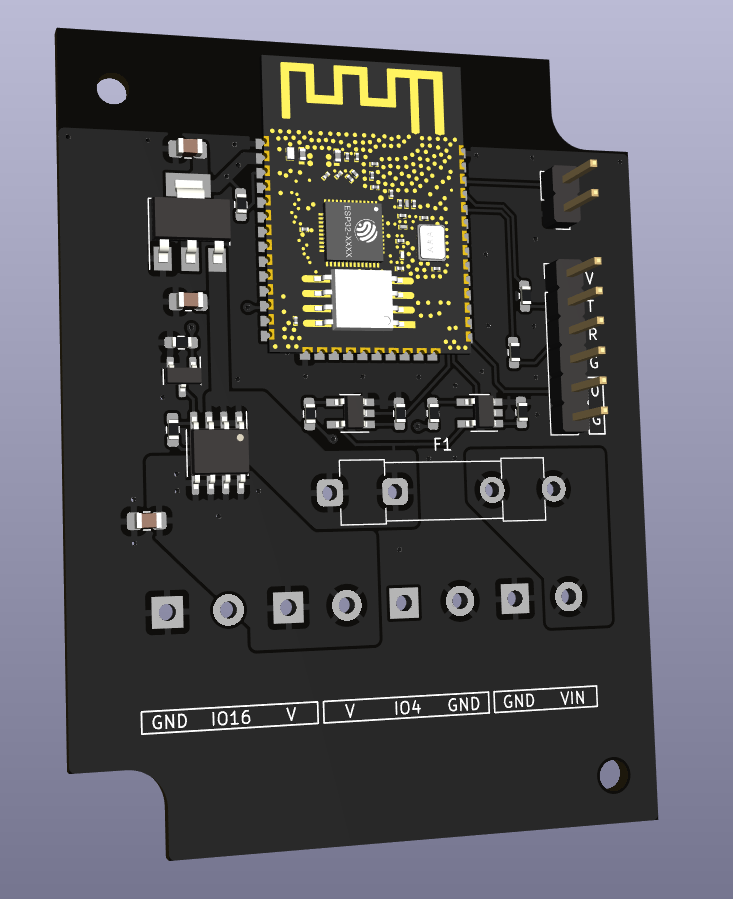

ESPilepsy
=========

A small ESP32 board to drive 2 LED strips, intended to be used with [WLED](https://kno.wled.ge/)

## Status

In development

## Features and non-features

 - Only 5V LED strips
 - Works with at least 6A current
 - LEDs can be powered down via FET (no relay)
 - Normal fuse, no poly-fuse
 - No IR receiver
 - No reverse voltage protection
 - No built-in USB-to-UART

## Design constraints

 - Design rules compatible with [JLCPCB](https://jlcpcb.com/) (because it's cheap)
 - Use only parts available at [Reichelt](https://www.reichelt.de/) (because it's convenient)
 - If possible, use widely-used parts
 - SMD parts no smaller than 0603
 - pin spacing at least about 1mm (SOT23-5 is about the smallest acceptable)

## Bill of materials

(Work in progress)

### ESP32

All ESP32-WROOM-32x modules seem to be pin-compatible.

Reichelt:
 - [ESP32-WROOM-32D](https://www.reichelt.de/wifi-smd-modul-esp32-d0wd-4-mb-spi-3-3-v-18-x-25-5-x-3-2-mm-esp32wroom32d-p300012.html)
 - [ESP32-WROOM-32E-N4](https://www.reichelt.de/wifi-smd-modul-esp32-d0wd-v3-16-mb-spi-3-3-v-18-x-25-5-x-3-1-esp32wroom32e16-p300025.html)
 - [ESP32-WROOM-32E-N8](https://www.reichelt.de/wifi-modul-802-11-bt-2-4-2-5ghz-150mb-s-esp32wroom32e8-p311740.html)
 - [ESP32-WROOM-32E-N16](https://www.reichelt.de/wifi-smd-modul-esp32-d0wd-v3-16-mb-spi-3-3-v-18-x-25-5-x-3-1-esp32wroom32e16-p300025.html)

### High-side switch

There are lots of parts that can be used here

 - must be enhancement-type p-FET
 - SO-8 package
 - Vg(th) should be low enough that the FET is full on at ~4.5V
 
Reichelt: 
 - [AO4407A](https://www.reichelt.de/mosfet-p-kanal-30-v-12-a-rds-on-0-0085-ohm-so-8-ao-4407a-p166495.html)
 - [IRF9310](https://www.reichelt.de/mosfet-p-ch-30v-20a-2-5w-so-8-irf-9310-p132127.html)
 - [TSM160P02CS](https://www.reichelt.de/mosfet-p-ch-20v-11a-0-016r-so8-tsm160p02cs-p254930.html)

### Level Shifter

One-gate versions of the 74xx125 will fit, but will require the pull-down resistor on pin 1 to be mounted. The selected variant must be compatible with LVCMOS input voltages, so 74HCT, 74AHCT, 74VHCT, etc.

Reichelt:
 - [M74VHC1GT50](https://www.reichelt.de/buffer-cmos-1-65--5-5-v-sot-23-5-m74vhc1gt50dtt1g-p219278.html)

### Enclosure

Reichelt:
 - [4U32100603006](https://www.reichelt.de/industriegehaeuse-76-x-59-x-28-mm-ip54-schwarz-4u32100603006-p324273.html)

### Screw Terminals

AKL073 from Reichelt won't fit into the enclosure.

Reichelt:
 - [AKL 101-02](https://www.reichelt.de/anschlussklemme-2-pol-2-mm-rm-5-08-akl-101-02-p36605.html)
 - [CTB0509-2](https://www.reichelt.de/loetbare-schraubklemme-2-pol-rm-5-08-mm-90--ctb0509-2-p292701.html)

## Similar projects

If this doesn't fit your needs, check out these other cool boards:

 - [Yet Another WLED Controller](https://github.com/lizardsystems/yawl-controller)
